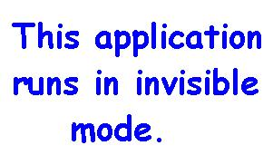



## Obscenity Filter

### Description

This application will try to close IE windows whose title captions contain obscene words.

The app checks for dirty words in the title bars of IE windows and if it finds one, try to close it. I have included a file named "WordsList" which contains some dirty words.
 
### More Info
 

             |
---                |---
**Submitted On**   |2003-08-06 01:00:12
**By**             |[Min Thant Sin](https://github.com/Planet-Source-Code/PSCIndex/blob/master/ByAuthor/min-thant-sin.md)
**Level**          |Beginner
**User Rating**    |5.0 (10 globes from 2 users)
**Compatibility**  |VB 6\.0
**Category**       |[Miscellaneous](https://github.com/Planet-Source-Code/PSCIndex/blob/master/ByCategory/miscellaneous__1-1.md)
**World**          |[Visual Basic](https://github.com/Planet-Source-Code/PSCIndex/blob/master/ByWorld/visual-basic.md)
**Archive File**   |[Obscenity\_162467862003\.zip](https://github.com/Planet-Source-Code/min-thant-sin-obscenity-filter__1-47439/archive/master.zip)

